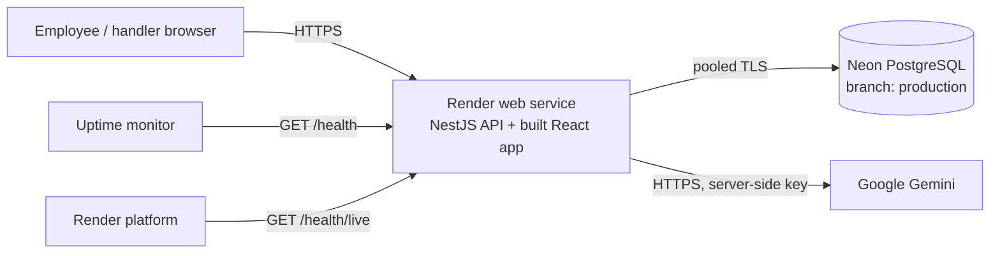

# Week 5 - Release operations (v0.5)

> This note records how Operations Hub is released, observed and recovered, and the evidence behind the release decision. Every result below is dated and was actually observed. Anything not yet done is marked **Pending** instead of being assumed. It follows Day 13 (prepare the release), Day 14 (operate the system) and Day 15 (own the release).

## In one minute

| Question | Answer |
| --- | --- |
| What is released? | One exact Git commit: React frontend + NestJS backend in a single web service, plus committed database migrations. |
| Where does it run? | Render (free web service) for the app, Neon (free PostgreSQL) for data, Google Gemini (free tier) for AI suggestions. No paid service and no dependency on a student laptop. |
| How is it proven before release? | `npm run verify:release` runs 6 checks in order and stops at the first failure. GitHub Actions runs the same gate on a clean machine. |
| How is the running app proven? | `GET /health` (database and AI checked separately) and `npm run smoke -- <url>` (read-only critical-path checks). |
| What can fail while the app still runs? | Gemini (key, quota, outage) -> **degraded**, manual submission still works. The database -> **unhealthy**, core journey blocked. |
| How is it recovered? | Restore the failed dependency or configuration, then prove health **and** the user path again. Recovery is not rollback. |
| Current decision | **GO** for code candidate `41d00c1`, live at https://operations-hub-3j52.onrender.com, after CI, live smoke and a live failure/recovery drill (see [Release decision](#release-decision)). |

## 1. Release identity (Day 13 / Day 15)

"Latest" is not a release identity. A release candidate is:

1. **One exact commit**: `verify:release` prints the full commit hash first.
2. **A clean working tree**: `verify:release` warns about uncommitted changes, and `-- --require-clean` refuses them (CI always uses it).
3. **A known configuration**: the variables in [section 3](#3-configuration-and-secrets).
4. **Repeatable evidence**: the gate in [section 4](#4-release-gate).

The running app reports its own identity: `GET /health` returns `release`, the deployed commit (Render provides `RENDER_GIT_COMMIT`; `RELEASE` can override it; locally it says `local`). The startup log line repeats it: `Internal Request Tracker release <commit> listening on ...`.

Render deploys a chosen commit. Automatic deploys should be switched off before the final submission so the live app stays on the submitted SHA.

## 2. Environments

| Environment | Purpose | App | Database | AI |
| --- | --- | --- | --- | --- |
| Local | Development and the local release gate | `npm start` (port 3000) + Vite (5173), or production mode on one port | Neon branch `development` (or local PostgreSQL) | Your Gemini key in `backend/.env` |
| CI | Clean-machine release gate | GitHub Actions, Ubuntu, Node 24 | Throwaway PostgreSQL 17 container | Not called: tests replace only the provider's network call |
| Production | The live app reviewers use | Render web service | Neon branch `production` | Gemini key stored in Render |

There is no separate staging server (the free plan allows one service). The staged rehearsal was the built candidate run locally in production mode on one port against Neon `development` (smoke 7/7 on 2026-09-26, [section 11](#11-smoke-checks)) before the first deploy.

Tests never use the main data of any environment: each test creates its own temporary schema (`test_<random>`) and drops it afterwards.

## 3. Configuration and secrets

Configuration says *where and how* an instance runs; product rules (permissions, lifecycle, validation) never depend on it.

| Variable | Read when | Secret? | Where it is set | Purpose |
| --- | --- | --- | --- | --- |
| `DATABASE_URL` | Backend start | **Yes** (contains the password) | `backend/.env` locally, Render dashboard | Pooled PostgreSQL address used by the app |
| `DIRECT_URL` | Migrations, test setup | **Yes** | same | Direct PostgreSQL address (migrations cannot use the pooler) |
| `GEMINI_API_KEY` | Each AI call | **Yes** | same | Gemini access; empty means AI is "not configured" |
| `GEMINI_MODEL` | Each AI call | No | same | Default `gemini-3.1-flash-lite` |
| `PORT` | Backend start | No | Set by Render | Listening port |
| `HOST` | Backend start | No | Optional | Defaults to `0.0.0.0` on Render, `127.0.0.1` elsewhere |
| `TRUST_PROXY` | Backend start | No | Render dashboard | Proxy hops, so rate limits see the real visitor address |
| `AI_REQUESTS_PER_MINUTE` / `AI_REQUESTS_PER_DAY` / `WRITE_REQUESTS_PER_MINUTE` | Backend start | No | Optional | Rate limits (defaults 10 / 300 / 60) |
| `NODE_VERSION` or `.nvmrc` | Build | No | `.nvmrc` = 24 | Node version for Render and CI |

Rules:

- `.env` is ignored by Git; `backend/.env.example` lists every name with placeholders only. Real values are never committed, never placed in frontend code, and never printed in logs or health responses.
- There is **no build-time frontend configuration**: the frontend calls relative paths (`/requests`, `/actors`, `/health`) on the same address that served it, so the built bundle works on any host.
- Development and production use separate Neon branches with separate credentials. A new branch copies its parent's password, and the first password appeared in a setup screenshot, so the production password was reset in Neon before it was placed in Render. The new production address later also appeared in a setup screenshot; since all data is fictional, the owner accepted that risk. Rotating it takes a Neon **Reset password** on branch `production` plus updating `DATABASE_URL` and `DIRECT_URL` in Render (Render then restarts the app). The development branch holds only fictional data; its owner accepted the same risk there.

## 4. Release gate

`npm run verify:release` (repository root) runs these checks **in this order** and stops at the first failure:

| # | Check | Command | What it proves |
| --- | --- | --- | --- |
| 1 | Backend build | `backend: npm run build` | TypeScript compiles |
| 2 | Frontend type-check and build | `frontend: npm run build` | Types are correct and the production bundle builds |
| 3 | Backend tests | `backend: npm test` | Lifecycle, permissions, validation, AI boundary, rate limits, health, ticket numbers (HTTP against a real database) |
| 4 | Database integration | `backend: npm run test:integration` | Saved status and history read back through a second client; reset behavior |
| 5 | Offline AI evals | `backend: npm run eval:ai` | 8 prepared provider responses through the real adapter and validator |
| 6 | Browser end-to-end | `frontend: npm run test:e2e` | Full user journeys in Chromium against the real backend and database |

The gate proves the **candidate**. It cannot prove the running target (a green gate cannot tell you a dependency failed five minutes later), so health and smoke checks are separate.

### Gate results

| Date | Candidate | Result |
| --- | --- | --- |
| 2026-09-26 | `abfd064` + uncommitted changes (local, Neon `development`) | **HOLD** at step 3: two tests expected ticket `REQ-1006` and received `REQ-1015` and `REQ-1017`. See the incident below. |
| 2026-09-26 | same, after the fix | **All 6 passed**: builds; 27/27 backend tests; 1/1 integration; 8/8 offline evals; 3/3 browser journeys. Not a release candidate because the tree was uncommitted. |
| 2026-09-26 | `4eb0043` (clean tree), GitHub Actions on `ubuntu-latest`, PostgreSQL 17 service | **All 6 passed** in 1 min 28 s: builds; 27/27 backend tests; 1/1 integration; 8/8 offline evals; 3/3 browser journeys. [Run 36258470225](https://github.com/joesfeir0/internal-request-tracker/actions/runs/36258470225). |
| 2026-09-27 | `41d00c1` (clean tree), GitHub Actions | **All 6 passed** in 1 min 18 s, with the CI actions on `v5` (Node 20 warning gone). [Run 36318974101](https://github.com/joesfeir0/internal-request-tracker/actions/runs/36318974101). This is the commit deployed to Render. |
| 2026-09-29 | `41d00c1` + uncommitted documentation (local, Neon `development`) | **HOLD** at step 3: 7 of 11 backend tests went over Prisma's 5-second transaction limit (for example "5288 ms passed"). Hypothesis tested: from the laptop, one database round trip to Neon (US East) took 220-450 ms, and a transaction with 10 simple queries took 4.4 s. Cause: network distance between the laptop and the database, not the code. The same commit is green in CI, where the database runs next to the tests, and production runs in the same region as Neon. No code was changed for this. |
| Pending | Final submitted SHA | Gate on the exact commit that is submitted (documentation-only on top of `41d00c1`) |

### Incident caught by the gate: ticket numbers leaking between tests

- **Symptom:** a test's first ticket should be `REQ-1006`; it was `REQ-1015`, then `REQ-1017`.
- **Evidence:** each test uses its own schema, and the tables were correctly created there. The number came from `nextval('request_number_seq')`, a raw SQL query. Prisma's `?schema=` setting applies to Prisma's own queries, not to raw SQL, so every test was drawing numbers from the **development** schema's counter.
- **Impact:** tests were advancing development data (the counter only; no tickets were written there). Production has a single schema, so live numbering was never wrong.
- **Fix:** the store names the sequence with its schema explicitly (`"<schema>"."request_number_seq"`, schema taken from the database address and validated).
- **Proof:** a second test in another schema must also receive `REQ-1006`; both pass. The development counter read 1018 before and after the fixed tests ran (unchanged). It was then reset to 1006, because only the five demo tickets exist there, and it stayed at 1006 through the next full gate run.
- **Lesson:** "it passed once" was luck. The repeatable gate turned it into evidence.

## 5. Continuous integration

[`.github/workflows/release-gate.yml`](../.github/workflows/release-gate.yml) runs on every push to `main` and every pull request:

push -> checkout -> Node 24 (from `.nvmrc`) -> `npm ci` backend and frontend -> install Chromium -> `npm run verify:release -- --require-clean`, against a throwaway PostgreSQL 17 service. It needs no secrets.

| Proven | Not yet claimed |
| --- | --- |
| The workflow runs the same command as the local gate | A green run for the final submitted SHA (**Pending**) |
| The same sequence passed locally on Node 24 (Windows) and remotely on `ubuntu-latest` for `4eb0043` and `41d00c1` | |

## 6. Deployment design



| Setting | Value |
| --- | --- |
| Service type | Render Web Service, Free instance, Node runtime, region matching Neon (US East Ohio) |
| Build command | `npm run build && npm --prefix backend run db:migrate` |
| Start command | `npm start` (runs `backend/dist/main.js`, which also serves `frontend/dist`) |
| Health check path | `/health/live` (process only, so platform checks never wake the database or call AI) |
| Environment | `NODE_VERSION=24`, `DATABASE_URL`, `DIRECT_URL`, `GEMINI_API_KEY`, `TRUST_PROXY=1` (see section 3) |
| Migrations | Applied during the build with `db:migrate`, which never inserts or deletes rows. Seeding and reset are never part of a deploy. |

Why this shape: one service keeps the frontend and API on one origin (no CORS, no dev proxy in production); PostgreSQL keeps data outside Render's disposable disk. See [ADR-002](decisions/ADR-002.md).

**Free-tier limits (disclosed, not hidden):**

- Render's free instance sleeps after about 15 minutes without traffic and needs up to about a minute to wake. Open the app a few minutes before a demo.
- Neon's free plan suspends idle compute (wakes in about a second) and has monthly compute and 0.5 GB storage limits. Frequent database checks would keep it awake, which is why the platform health check uses `/health/live`.
- Gemini's free tier has rate limits and may use submitted content to improve Google products: use fictional data only. Google AI Studio (checked 2026-09-29) lists these free limits for `gemini-3.1-flash-lite`: 15 requests a minute, 250K tokens a minute, 500 requests a day. The busiest day in the previous 7 days used **56 of 500** (drill, incidents and tests included) ([rate limits](evidence/gemini-rate-limits-2026-09-29.png)), and the AI Studio error chart for 2026-09-28 shows only HTTP 503 responses, no 429 (quota used up) ([usage and errors](evidence/gemini-usage-2026-09-28.png)). The app's own limits (10 AI suggestions a minute per client, 300 a day in total) and the monitor's expected 48 scheduled checks a day keep normal use well below Google's daily limit. This is not a hard cap on provider calls: a 503 is retried once, anyone can open `/health` (a probe runs when the stored result is old), and the in-memory counters reset when the app restarts.
- This is a demo deployment, not a production SLA.

| Deployment evidence (2026-09-27) | Result |
| --- | --- |
| Live URL | https://operations-hub-3j52.onrender.com |
| First deploy | Commit `41d00c1`; build 46.6 s; `Migrations applied; data unchanged.`; startup log `release 41d00c15fe3a`; Render's `/health/live` checks return 200 |
| Deployed commit reported by `/health` | `41d00c15fe3a` |
| Production database | Neon branch `production`. It started empty (live smoke showed 0 tickets, which also proved it is not the development database). The five demo tickets were added once from the owner's PC with `npm run db:setup` (not part of any deploy). |
| Data survives a redeploy/restart | Yes. Ticket `REQ-1007`, created at 13:50 UTC, was still present with its history and note after the recovery redeploy and after drill cycles 2 and 3 (checked 14:09 and 14:18 UTC). Every redeploy logged `Migrations applied; data unchanged.` |

## 7. Health: running is not healthy (Day 14)

| Endpoint | Question it answers | Used by |
| --- | --- | --- |
| `GET /health/live` | Is the process running? Always `{ "status": "ok" }` when alive. | Render's frequent checks |
| `GET /health` | Can the system do its important work? | Monitoring, smoke checks, release decisions |

`GET /health` returns `{ status, checks: { database, triageModel }, release, checkedAt }`:

| status | database | triageModel | HTTP | Meaning |
| --- | --- | --- | --- | --- |
| `ok` | ok | ok | 200 | Everything works |
| `degraded` | ok | `unavailable` or `not_configured` | 200 | AI is down; manual submission and tracking still work |
| `unhealthy` | `unavailable` | any | 503 | Requests cannot be read or saved |

- **Database check:** `SELECT 1` with a 5-second limit.
- **AI check without wasting quota:** the latest real AI result is trusted for 10 minutes if it succeeded and 1 minute if it failed; only then is one small probe sent. A real user's failure therefore shows immediately, and recovery shows within a minute.
- **HTTP 200 can still mean HOLD:** `degraded` answers 200 so AI trouble never makes the platform restart a working tracker, but it is not a GO.
- **Health is one signal, not the whole truth:** it does not prove the quality of AI answers (evals do), that every user journey works (smoke and E2E do), or that nothing else is failing. Logs, smoke checks and tests add the rest.
- **Safe to expose:** only states, the release and a time. Never keys, connection strings, provider URLs, raw errors or request data (tested).

## 8. Logs

One line per API call, and a warning or error line when something fails:

```
[HTTP] GET /requests 200 836ms
[AiIntake] AI intake failed: Provider unavailable (HTTP 429)
[Requests] Status change failed for REQ-1006: P1001
[Health] Health degraded: database=ok, triageModel=unavailable (Provider could not be reached)
```

| Logged (useful evidence) | Never logged |
| --- | --- |
| Method, path, status, duration | Request bodies, descriptions, comments |
| Ticket number, actor ID for failed saves | AI prompts and responses |
| Safe failure category (timeout, HTTP status, invalid output) | API keys, connection strings, provider URLs |
| Database error code (for example `P1001`, cannot reach server) | Raw error messages that could contain data |

Health says **what** is unavailable; the log says **why**. On Render, logs are in the service's **Logs** tab.

## 9. Monitoring and alerting

One request is one observation, not monitoring. Two free UptimeRobot monitors watch the live app and email the owner:

| Monitor | Checks | Interval | Alerts when | Why |
| --- | --- | --- | --- | --- |
| A: process | `https://operations-hub-3j52.onrender.com` (HTTP) | 5 min | The page does not answer | Shows the server is running, and keeps the free instance awake so reviewers avoid the cold start. Touches neither the database nor AI. |
| B: capability | `/health` (keyword `"status":"ok"`, timeout 60 s) | 30 min (5 min from the drill on 2026-09-27 until 2026-09-28, so during both real incidents below) | The keyword is missing: `degraded`, `unhealthy` or no answer | Real health. A keyword check is needed because `degraded` still returns HTTP 200. 30 minutes keeps Neon's free compute and Gemini's free quota low: about 48 scheduled checks a day (see the Gemini limits in section 6). |

The alert is resolved on the first check that finds `"status":"ok"` again. Both monitors Up with these intervals on 2026-09-29: [screenshot](evidence/monitors-2026-09-29.png). The same signal is checked by hand with `npm run smoke -- <url>`.

| Monitoring evidence (2026-09-27) | Result |
| --- | --- |
| Both monitors configured on the live URL | Yes; both **Up** before the drill |
| Alert observed during the drill | Yes. Monitor B opened an incident at **13:58:15 UTC**, reason "Keyword Does Not Exist", checked from Ohio, USA, while monitor A stayed Up (running is not healthy). [Monitor screenshot](evidence/drill-3-monitor-down.png), [alert email](evidence/drill-4-alert-email-down.png). |
| Resolved after recovery | Monitor B returned to Up after the key was restored; the incident history is kept in UptimeRobot. |

**Real incidents after the drill (2026-09-28).** Nobody changed anything; monitor B opened two incidents on its own. Times are UTC, from UptimeRobot and the Render logs.

| Incident | Started | Resolved | Duration | Cause (from the log) | Evidence |
| --- | --- | --- | --- | --- | --- |
| A | 10:52:36 | 10:57:42 | 5 min 6 s | The AI call got no answer within the 20 s limit: `Health degraded: database=ok, triageModel=unavailable (Provider timed out)`; that `/health` call took 20,005 ms | [Resolved email](evidence/incident-2026-09-28-A-resolved-email.png), [log reason](evidence/incident-2026-09-28-A-logs-degraded.png), [health checks](evidence/incident-2026-09-28-A-logs-health-checks.png) |
| B | 18:05:14 | 18:20:39 | about 15 min | Gemini returned HTTP 503 (unavailable), also on the one automatic retry: `Health degraded: database=ok, triageModel=unavailable (Provider unavailable (HTTP 503))` on every check from 18:04 to 18:15 | [Down email](evidence/incident-2026-09-28-B-down-email.png), [UptimeRobot activity log](evidence/incident-2026-09-28-B-activity-log.png), [log reason](evidence/incident-2026-09-28-B-logs-degraded.png), [health checks](evidence/incident-2026-09-28-B-logs-health-checks.png) |

**2026-09-29, the same pattern again (shorter record).** The Render log shows `Health degraded: database=ok, triageModel=unavailable (Provider unavailable (HTTP 503))` at 15:47:55 and 15:49:40 UTC, and again from 18:15:03 to 18:15:51 UTC ([log](evidence/incident-2026-09-29-logs-degraded.png)). At 15:47 a live smoke check got HTTP 502 for the AI suggestion while the other 6 checks passed, and a new ticket, `REQ-1008`, was saved at 15:50:51 UTC during this period. No action was taken. At 19:28:46 UTC `/health` was `ok` and the live smoke passed 7/7. Exact end times were not recorded.

What they show:

- **The AI dependency failed; the product did not.** The AI call timed out (A) or returned HTTP 503 (B); database health stayed `ok` throughout, so the status was `degraded` (manual submission and tracking kept working), not `unhealthy`. The 503 shows the provider was unavailable. The timeout alone does not show why (Google or the network in between), so no deeper root cause is claimed for A.
- **Detection worked without a planned drill.** Health reported the failure, the log gave the reason, and UptimeRobot emailed the owner, then sent a resolved email. For incident B its activity log shows the check failing from four locations (Ashburn, Dallas, Ohio, N. Virginia) before the alert.
- **The quota protection worked.** Confirmation checks within a minute of a failure reused the stored result (5-12 ms) instead of calling Gemini again.
- **Recovery needed no action.** When Gemini answered again (10:57:42, after 2,184 ms; 18:20:40, after 5,160 ms), health returned to `ok` and the incidents closed. Because the AI is advisory, waiting was the right response; restarting the app would not have helped.

## 10. Controlled failure and recovery drill (Day 14 / Day 15)

Only one dependency is broken, and the code does not change. The database is never reset during the drill.

| Step | Action | Evidence to record |
| --- | --- | --- |
| 1. Known good | `npm run smoke -- <url>` | health `ok`, all smoke checks pass, monitor up |
| 2. Inject failure | In Render, replace `GEMINI_API_KEY` with an invalid value and save (the service restarts) | time of change |
| 3. Detect | Ask for an AI suggestion in the app; check `/health`; wait for the monitor | UI error with manual fallback; `status: degraded`, `triageModel: unavailable`; monitor alert |
| 4. Diagnose | Read Render logs | `AI intake failed: Provider unavailable (HTTP 400)` or similar; hypothesis tested before calling it root cause |
| 5. Core path still works | Submit a ticket manually, claim it, change status | ticket number, statuses saved |
| 6. Recover | Restore the correct key in Render | time of change |
| 7. Verify | `/health` `ok` again; smoke passes; AI suggestion works; the earlier ticket is still there | outputs and times; monitor resolved |
| 8. Repeat | Run the cycle again without reseeding | same results |

Recovery restores a failed dependency or configuration. **Rollback** (Render: redeploy a previous successful deploy) moves to an older version; it is described here but has **not been rehearsed**, and is not claimed.

Local rehearsal already proven by automated tests (`backend/test/health.test.cjs`): ok -> real AI failure shows `degraded` at once without a new probe -> manual submission still returns 201 -> provider restored -> `ok` -> database outage returns 503 `unhealthy` -> no secrets or raw errors in any response.

### Live drill results (2026-09-27, UTC, release `41d00c15fe3a` throughout)

**Cycle 1: every step recorded.** Raw operator log with the full outputs: [drill-log-2026-09-27.txt](evidence/drill-log-2026-09-27.txt).

| Step | Time | Evidence |
| --- | --- | --- |
| 1. Known good | 13:46:06 | Smoke 7/7: health `ok` (database ok, triageModel ok), AI suggestion `IT` in 0.97 s, 6 tickets; both monitors Up |
| 2. Inject failure | ~13:48 | Render `GEMINI_API_KEY` set to `drill-invalid-key`; redeploy of the same commit logged `Migrations applied; data unchanged.` |
| 3. Detect | 13:50:04 | `/health` -> `{"status":"degraded","checks":{"database":"ok","triageModel":"unavailable"}}`; AI suggestion -> HTTP 502 with the stable message, no provider details |
| 4. Diagnose | 13:50:09 | Render log `WARN [AiIntake] AI intake failed: Provider unavailable (HTTP 400)` ([screenshot](evidence/drill-2-log-ai-intake-failed.png)). Hypothesis: the provider rejects the key. Tested against the configuration: the key was the drill value, so the root cause was confirmed. No key, text or provider address in the log. |
| 5. Core path still works | 13:50:23 | Maya submitted to IT by hand -> `REQ-1007`; Rami claimed it (201) and moved it to IN_PROGRESS with a note (history 2, comments 1) |
| Alert | 13:58:15 | UptimeRobot monitor B incident "Keyword Does Not Exist" plus email; monitor A stayed Up |
| 6. Recover | ~14:08 | Real key restored in Render (configuration only; no code change, no rollback) |
| 7. Verify | 14:09:53 | `/health` `ok`; smoke 7/7 with AI suggestion `IT` in 1.4 s; `REQ-1007` intact after the restart; monitor B back to Up |

**Cycles 2 and 3.** The owner repeated the same failure and recovery (invalid key, then real key restored) between 14:10 and 14:18 UTC. Per-step times for these two cycles were not captured, and UptimeRobot recorded no separate incident for them: both ran within about 8 minutes while monitor B checked every 5 minutes, so the short breaks fell between checks. Their evidence is the verified final state below. Final state verified at **14:18:40 UTC**: `/health` `ok`, smoke 7/7 with a real AI suggestion, all 7 tickets present (including `REQ-1007` from cycle 1). No reseeding at any point.

**Detection time.** The health endpoint showed `degraded` within about two minutes of the change (the time for the redeploy plus one check). The monitor took about eight more minutes, because it checks on an interval. For faster alerts, use a shorter interval, at a cost to Neon's free compute.

## 11. Smoke checks

`npm run smoke -- <url>` is read-only: it never creates or changes requests. It checks health, that the frontend is served, the demo accounts, an employee's own list, a boundary denial (another employee gets 404 for `REQ-1001`), an unknown actor (401), and one AI suggestion (`--skip-ai` skips it).

| Date | Target | Result |
| --- | --- | --- |
| 2026-09-26 | Local, production mode (built backend serving the built frontend on port 3100, Neon `development`) | **7/7 passed**: health `ok` (database ok, triageModel ok), frontend 200, 6 accounts, 5 requests, 404, 401, AI suggestion `IT` in 2.1 s. Logs contained only method, path, status and duration. |
| 2026-09-27 13:46 UTC | Live (`41d00c15fe3a`), drill baseline | **7/7 passed**, AI `IT` in 0.97 s |
| 2026-09-27 14:09 UTC | Live, after drill cycle 1 recovery | **7/7 passed**, AI `IT` in 1.4 s |
| 2026-09-27 14:18 UTC | Live, after drill cycles 2 and 3 | **7/7 passed**, AI `IT` in 0.98 s, 7 tickets |
| Pending | Live, final submitted SHA | |

## Release decision

Evidence rows from Day 15 (no score, no percentage). A single missing or red row means HOLD.

| Evidence row | GO needs | Evidence (2026-09-27) | Row |
| --- | --- | --- | --- |
| Release identity | Exact committed candidate, clean tree | `41d00c1`, committed and clean; `/health` on the live app reports `41d00c15fe3a` | GREEN |
| Automated confidence | Required checks pass | GitHub Actions 6/6 for `41d00c1` (and earlier `4eb0043`); local gate 6/6 on 2026-09-26. A local run on 2026-09-29 stopped on laptop-to-database latency, not code ([Gate results](#gate-results)) | GREEN |
| Configuration | Expected and safe | Production values set in Render, secrets not in Git, migrations only (no seeding) on deploy | GREEN |
| Health | `ok` on the target | Live `/health` `ok` at 13:46, 14:09 and 14:18 UTC | GREEN |
| Critical smoke | Critical path works on the target | Live smoke 7/7 three times, including boundaries (404, 401) and a real AI suggestion | GREEN |
| Recovery readiness | Known and proven | Live drill: failure detected (health, logs, monitor alert), core path kept working, recovery verified; cycle 1 fully recorded including the monitor alert; repeated twice more by the owner without reseeding (final state verified) | GREEN |

**Decision: GO** for code candidate `41d00c1` on https://operations-hub-3j52.onrender.com.

**The same code can deserve HOLD.** While the drill key was broken (13:50-14:09 UTC on 2026-09-27) and during the real AI failures on 2026-09-28 and 2026-09-29, the Health row was `degraded`, so the decision for this same commit was HOLD. It returned to GO only after fresh evidence: health `ok` again and, after the drill, smoke 7/7. Nothing about the code changed; the evidence did.

GO does not mean zero risk (see below). The submission commit adds only documentation and evidence on top of `41d00c1`. Before submitting: CI must be green on that exact commit, `/health` must report it as the live release, and a final smoke must pass. Then automatic deploys are switched off.

## Remaining risks (accepted for the demo)

- **Demo identity, not login.** Anyone with the URL can choose a demo account; the server still enforces what each account may see and do. Real use would put the organization's sign-in in front (Day 15 lists enterprise SSO as a non-goal). See [ADR-003](decisions/ADR-003.md).
- **Free tiers.** Cold starts, compute/storage caps and Gemini rate limits; no uptime promise.
- **AI availability.** Gemini's free tier is intermittent: see Week 4, the two real incidents on 2026-09-28 (a timeout and HTTP 503) and more HTTP 503 periods on 2026-09-29. The product stays usable when AI is down, and the monitor reports it as `degraded`.
- **Local tests need a nearby database.** Against a distant Neon branch the backend tests can go over Prisma's 5-second transaction limit (seen 2026-09-29). CI and production are not affected; a local PostgreSQL or a closer network avoids it.
- **Rate limits are in memory** and reset when the instance restarts; they protect the free quota, not against a determined attacker.
- **Dependency audit.** `npm audit` on 2026-09-29: backend 5 high (0 critical) in the Nest/Multer and Prisma/deepmerge-ts chains; frontend 0. Not fixed for this release, to avoid dependency changes after GO. The Multer findings need file uploads and there is no upload endpoint; the Prisma ones affect its configuration tooling, which only reads this repository's own configuration.
- **Data sensitivity.** Only fictional data. HR/Finance content would need an approved AI arrangement and narrower visibility before real use.

## Handoff checklist (Day 15)

- [x] README has live-app, engineer quick-start, operations and evidence-map sections
- [x] Week 1-5 documents present and updated where implementation changed a decision
- [x] Safe environment template (`backend/.env.example`) and no secrets in Git
- [x] Release gate, CI workflow, health endpoint, safe logs, smoke check
- [x] Commit and push; first green remote CI run (`4eb0043`)
- [x] Deploy to Render with Neon `production`; live URL and deployed commit recorded (`41d00c1`)
- [x] Monitors configured; live failure -> detect -> recover -> verify drill (cycle 1 fully recorded, two more cycles by the owner)
- [x] GO recorded for `41d00c1`
- [ ] Push the documentation commit; CI green; `/health` reports that commit; final smoke 7/7
- [x] Monitor B back to a 30-minute interval (2026-09-29)
- [ ] Automatic deploys off so the live app stays on the submitted SHA

### Submission details (Day 15)

Email subject: `AI Academy 2026 - Final Capstone Submission - Joseph Sfeir`. The body needs these fields; fill them only with final, verified values:

| Field | Value |
| --- | --- |
| Full Name | Joseph Sfeir |
| Repository URL | https://github.com/joesfeir0/internal-request-tracker |
| Final Commit SHA | Pending (the documentation commit, once CI is green and it is live) |
| Live App URL | https://operations-hub-3j52.onrender.com |
| Demo Access / Roles | No login: open the live app and pick an account in the **Testing workspace** menu. Maya Haddad (`employee-001`) and Karim Nassar (`employee-002`): employees, submit and follow only their own requests. Rami Khoury (`handler-001`) and Lina Farah (`handler-004`): IT handlers (only the assigned handler changes status). Nour Saleh (`handler-002`): HR handler. Omar Aoun (`handler-003`): Finance handler. Permissions are checked on the server for every request. Details: README [Demo access and roles](../README.md#demo-access-and-roles). |

The submitted SHA is frozen: later pushes do not count unless requested, and the live app must stay reachable through the defense.
