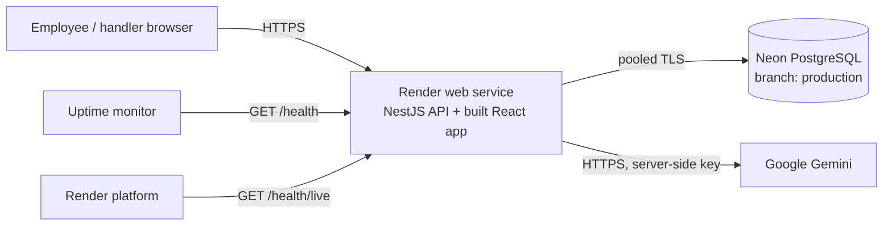

# Week 5 - Release operations (v0.5)

> This note records how Operations Hub is released, observed and recovered, and the evidence behind the release decision. Every result below is dated and was actually observed. Anything not yet done is marked **Pending** instead of being assumed. It follows Day 13 (prepare the release), Day 14 (operate the system) and Day 15 (own the release).

## In one minute

| Question | Answer |
| --- | --- |
| What is released? | One exact Git commit: React frontend + NestJS backend in a single web service, plus committed database migrations. |
| Where does it run? | Render (free web service) for the app, Neon (free PostgreSQL) for data, Google Gemini (free tier) for AI suggestions. No paid service and no dependency on a student laptop. |
| How is it proven before release? | `npm run verify:release` runs 6 checks in order and stops at the first failure. GitHub Actions runs the same gate on a clean machine. |
| How is the running app proven? | `GET /health` (database and AI checked separately) and `npm run smoke -- <url>` (read-only critical-path checks). |
| What can fail while the app still runs? | Gemini (key, quota, outage) -> **degraded**, manual submission still works. The database -> **unhealthy**, core journey blocked. |
| How is it recovered? | Restore the failed dependency or configuration, then prove health **and** the user path again. Recovery is not rollback. |
| Current decision | **HOLD** until the deployed target, remote CI run and live recovery drill are proven (see [Release decision](#release-decision)). |

## 1. Release identity (Day 13 / Day 15)

"Latest" is not a release identity. A release candidate is:

1. **One exact commit**: `verify:release` prints the full commit hash first.
2. **A clean working tree**: `verify:release` warns about uncommitted changes, and `-- --require-clean` refuses them (CI always uses it).
3. **A known configuration**: the variables in [section 3](#3-configuration-and-secrets).
4. **Repeatable evidence**: the gate in [section 4](#4-release-gate).

The running app reports its own identity: `GET /health` returns `release`, the deployed commit (Render provides `RENDER_GIT_COMMIT`; `RELEASE` can override it; locally it says `local`). The startup log line repeats it: `Internal Request Tracker release <commit> listening on ...`.

Render deploys a chosen commit. Automatic deploys should be switched off before the final submission so the live app stays on the submitted SHA.

## 2. Environments

| Environment | Purpose | App | Database | AI |
| --- | --- | --- | --- | --- |
| Local | Development and the local release gate | `npm start` (port 3000) + Vite (5173), or production mode on one port | Neon branch `development` (or local PostgreSQL) | Your Gemini key in `backend/.env` |
| CI | Clean-machine release gate | GitHub Actions, Ubuntu, Node 24 | Throwaway PostgreSQL 17 container | Not called: tests replace only the provider's network call |
| Production | The live app reviewers use | Render web service | Neon branch `production` | Gemini key stored in Render |

Tests never use the main data of any environment: each test creates its own temporary schema (`test_<random>`) and drops it afterwards.

## 3. Configuration and secrets

Configuration says *where and how* an instance runs; product rules (permissions, lifecycle, validation) never depend on it.

| Variable | Read when | Secret? | Where it is set | Purpose |
| --- | --- | --- | --- | --- |
| `DATABASE_URL` | Backend start | **Yes** (contains the password) | `backend/.env` locally, Render dashboard | Pooled PostgreSQL address used by the app |
| `DIRECT_URL` | Migrations, test setup | **Yes** | same | Direct PostgreSQL address (migrations cannot use the pooler) |
| `GEMINI_API_KEY` | Each AI call | **Yes** | same | Gemini access; empty means AI is "not configured" |
| `GEMINI_MODEL` | Each AI call | No | same | Default `gemini-3.1-flash-lite` |
| `PORT` | Backend start | No | Set by Render | Listening port |
| `HOST` | Backend start | No | Optional | Defaults to `0.0.0.0` on Render, `127.0.0.1` elsewhere |
| `TRUST_PROXY` | Backend start | No | Render dashboard | Proxy hops, so rate limits see the real visitor address |
| `AI_REQUESTS_PER_MINUTE` / `AI_REQUESTS_PER_DAY` / `WRITE_REQUESTS_PER_MINUTE` | Backend start | No | Optional | Rate limits (defaults 10 / 300 / 60) |
| `NODE_VERSION` or `.nvmrc` | Build | No | `.nvmrc` = 24 | Node version for Render and CI |

Rules:

- `.env` is ignored by Git; `backend/.env.example` lists every name with placeholders only. Real values are never committed, never placed in frontend code, and never printed in logs or health responses.
- There is **no build-time frontend configuration**: the frontend calls relative paths (`/requests`, `/actors`, `/health`) on the same address that served it, so the built bundle works on any host.
- Development and production use separate Neon branches with separate credentials. The production password is reset in Neon (Connect -> branch `production` -> Reset password) before it is placed in Render, because a new branch copies its parent's password and development credentials appeared during setup. The development branch holds only fictional data; its owner accepted that risk.

## 4. Release gate

`npm run verify:release` (repository root) runs these checks **in this order** and stops at the first failure:

| # | Check | Command | What it proves |
| --- | --- | --- | --- |
| 1 | Backend build | `backend: npm run build` | TypeScript compiles |
| 2 | Frontend type-check and build | `frontend: npm run build` | Types are correct and the production bundle builds |
| 3 | Backend tests | `backend: npm test` | Lifecycle, permissions, validation, AI boundary, rate limits, health, ticket numbers (HTTP against a real database) |
| 4 | Database integration | `backend: npm run test:integration` | Saved status and history read back through a second client; reset behavior |
| 5 | Offline AI evals | `backend: npm run eval:ai` | 8 prepared provider responses through the real adapter and validator |
| 6 | Browser end-to-end | `frontend: npm run test:e2e` | Full user journeys in Chromium against the real backend and database |

The gate proves the **candidate**. It cannot prove the running target (a green gate cannot tell you a dependency failed five minutes later), so health and smoke checks are separate.

### Gate results

| Date | Candidate | Result |
| --- | --- | --- |
| 2026-09-26 | `abfd064` + uncommitted changes (local, Neon `development`) | **HOLD** at step 3: two tests expected ticket `REQ-1006` and received `REQ-1015` and `REQ-1017`. See the incident below. |
| 2026-09-26 | same, after the fix | **All 6 passed**: builds; 27/27 backend tests; 1/1 integration; 8/8 offline evals; 3/3 browser journeys. Not a release candidate because the tree was uncommitted. |
| Pending | Final committed SHA | Local gate with `--require-clean`, and the first remote GitHub Actions run |

### Incident caught by the gate: ticket numbers leaking between tests

- **Symptom:** a test's first ticket should be `REQ-1006`; it was `REQ-1015`, then `REQ-1017`.
- **Evidence:** each test uses its own schema, and the tables were correctly created there. The number came from `nextval('request_number_seq')`, a raw SQL query. Prisma's `?schema=` setting applies to Prisma's own queries, not to raw SQL, so every test was drawing numbers from the **development** schema's counter.
- **Impact:** tests were advancing development data (the counter only; no tickets were written there). Production has a single schema, so live numbering was never wrong.
- **Fix:** the store names the sequence with its schema explicitly (`"<schema>"."request_number_seq"`, schema taken from the database address and validated).
- **Proof:** a second test in another schema must also receive `REQ-1006`; both pass. The development counter read 1018 before and after the fixed tests ran (unchanged). It was then reset to 1006, because only the five demo tickets exist there, and it stayed at 1006 through the next full gate run.
- **Lesson:** "it passed once" was luck. The repeatable gate turned it into evidence.

## 5. Continuous integration

[`.github/workflows/release-gate.yml`](../.github/workflows/release-gate.yml) runs on every push to `main` and every pull request:

push -> checkout -> Node 24 (from `.nvmrc`) -> `npm ci` backend and frontend -> install Chromium -> `npm run verify:release -- --require-clean`, against a throwaway PostgreSQL 17 service. It needs no secrets.

| Proven | Not yet claimed |
| --- | --- |
| The workflow file exists and runs the same command as the local gate | A remote GitHub Actions run (**Pending** until the first push) |
| The same sequence passed locally on Node 24 (Windows) | A green run on `ubuntu-latest` |

## 6. Deployment design



| Setting | Value |
| --- | --- |
| Service type | Render Web Service, Free instance, Node runtime, region matching Neon (US East Ohio) |
| Build command | `npm run build && npm --prefix backend run db:migrate` |
| Start command | `npm start` (runs `backend/dist/main.js`, which also serves `frontend/dist`) |
| Health check path | `/health/live` (process only, so platform checks never wake the database or call AI) |
| Environment | `DATABASE_URL`, `DIRECT_URL`, `GEMINI_API_KEY`, `TRUST_PROXY` (see section 3) |
| Migrations | Applied during the build with `db:migrate`, which never inserts or deletes rows. Seeding and reset are never part of a deploy. |

Why this shape: one service keeps the frontend and API on one origin (no CORS, no dev proxy in production); PostgreSQL keeps data outside Render's disposable disk. See [ADR-002](decisions/ADR-002.md).

**Free-tier limits (disclosed, not hidden):**

- Render's free instance sleeps after about 15 minutes without traffic and needs up to about a minute to wake. Open the app a few minutes before a demo.
- Neon's free plan suspends idle compute (wakes in about a second) and has monthly compute and 0.5 GB storage limits. Frequent database checks would keep it awake, which is why the platform health check uses `/health/live`.
- Gemini's free tier has rate limits and may use submitted content to improve Google products: use fictional data only.
- This is a demo deployment, not a production SLA.

| Deployment evidence | Status |
| --- | --- |
| Live URL | **Pending** |
| Deployed commit reported by `/health` | **Pending** |
| Data survives a redeploy/restart | **Pending** |

## 7. Health: running is not healthy (Day 14)

| Endpoint | Question it answers | Used by |
| --- | --- | --- |
| `GET /health/live` | Is the process running? Always `{ "status": "ok" }` when alive. | Render's frequent checks |
| `GET /health` | Can the system do its important work? | Monitoring, smoke checks, release decisions |

`GET /health` returns `{ status, checks: { database, triageModel }, release, checkedAt }`:

| status | database | triageModel | HTTP | Meaning |
| --- | --- | --- | --- | --- |
| `ok` | ok | ok | 200 | Everything works |
| `degraded` | ok | `unavailable` or `not_configured` | 200 | AI is down; manual submission and tracking still work |
| `unhealthy` | `unavailable` | any | 503 | Requests cannot be read or saved |

- **Database check:** `SELECT 1` with a 5-second limit.
- **AI check without wasting quota:** the latest real AI result is trusted for 10 minutes if it succeeded and 1 minute if it failed; only then is one small probe sent. A real user's failure therefore shows immediately, and recovery shows within a minute.
- **HTTP 200 can still mean HOLD:** `degraded` answers 200 so AI trouble never makes the platform restart a working tracker, but it is not a GO.
- **Safe to expose:** only states, the release and a time. Never keys, connection strings, provider URLs, raw errors or request data (tested).

## 8. Logs

One line per API call, and a warning or error line when something fails:

```
[HTTP] GET /requests 200 836ms
[AiIntake] AI intake failed: Provider unavailable (HTTP 429)
[Requests] Status change failed for REQ-1006: P1001
[Health] Health degraded: database=ok, triageModel=unavailable (Provider could not be reached)
```

| Logged (useful evidence) | Never logged |
| --- | --- |
| Method, path, status, duration | Request bodies, descriptions, comments |
| Ticket number, actor ID for failed saves | AI prompts and responses |
| Safe failure category (timeout, HTTP status, invalid output) | API keys, connection strings, provider URLs |
| Database error code (for example `P1001`, cannot reach server) | Raw error messages that could contain data |

Health says **what** is unavailable; the log says **why**. On Render, logs are in the service's **Logs** tab.

## 9. Monitoring and alerting

One request is one observation, not monitoring. Plan:

- An external free uptime monitor calls `GET /health` on a fixed interval (at least 15 minutes, to respect Neon's free compute).
- **Alert** when `/health` is not `ok` on repeated consecutive checks; **resolved** on the first `ok` afterwards. A single slow response while the free instance wakes is not an incident.
- The same signal is checked by hand with `npm run smoke -- <url>`.

| Monitoring evidence | Status |
| --- | --- |
| Monitor configured on the live URL | **Pending** |
| Alert observed during the drill, then resolved | **Pending** |

## 10. Controlled failure and recovery drill (Day 14 / Day 15)

Only one dependency is broken, and the code does not change. The database is never reset during the drill.

| Step | Action | Evidence to record |
| --- | --- | --- |
| 1. Known good | `npm run smoke -- <url>` | health `ok`, all smoke checks pass, monitor up |
| 2. Inject failure | In Render, replace `GEMINI_API_KEY` with an invalid value and save (the service restarts) | time of change |
| 3. Detect | Ask for an AI suggestion in the app; check `/health`; wait for the monitor | UI error with manual fallback; `status: degraded`, `triageModel: unavailable`; monitor alert |
| 4. Diagnose | Read Render logs | `AI intake failed: Provider unavailable (HTTP 400)` or similar; hypothesis tested before calling it root cause |
| 5. Core path still works | Submit a ticket manually, claim it, change status | ticket number, statuses saved |
| 6. Recover | Restore the correct key in Render | time of change |
| 7. Verify | `/health` `ok` again; smoke passes; AI suggestion works; the earlier ticket is still there | outputs and times; monitor resolved |
| 8. Repeat | Run the cycle again without reseeding | same results |

Recovery restores a failed dependency or configuration. **Rollback** (Render: redeploy a previous successful deploy) moves to an older version; it is described here but has **not been rehearsed**, and is not claimed.

Local rehearsal already proven by automated tests (`backend/test/health.test.cjs`): ok -> real AI failure shows `degraded` at once without a new probe -> manual submission still returns 201 -> provider restored -> `ok` -> database outage returns 503 `unhealthy` -> no secrets or raw errors in any response.

| Live drill evidence | Status |
| --- | --- |
| Full cycle on the deployed app, with times | **Pending** |
| Repeated without reseeding | **Pending** |

## 11. Smoke checks

`npm run smoke -- <url>` is read-only: it never creates or changes requests. It checks health, that the frontend is served, the demo accounts, an employee's own list, a boundary denial (another employee gets 404 for `REQ-1001`), an unknown actor (401), and one AI suggestion (`--skip-ai` skips it).

| Date | Target | Result |
| --- | --- | --- |
| 2026-09-26 | Local, production mode (built backend serving the built frontend on port 3100, Neon `development`) | **7/7 passed**: health `ok` (database ok, triageModel ok), frontend 200, 6 accounts, 5 requests, 404, 401, AI suggestion `IT` in 2.1 s. Logs contained only method, path, status and duration. |
| Pending | Live URL | |

## Release decision

Evidence rows from Day 15 (no score, no percentage). A single missing or red row means HOLD.

| Evidence row | GO needs | Current evidence (2026-09-26) | Row |
| --- | --- | --- | --- |
| Release identity | Exact committed candidate, clean tree | Changes not yet committed | HOLD |
| Automated confidence | Required checks pass | Local gate 6/6; remote CI pending | Pending |
| Configuration | Expected and safe | Documented; production values not yet set | Pending |
| Health | `ok` on the target | `ok` locally; target not deployed | Pending |
| Critical smoke | Critical path works on the target | 7/7 locally; target not deployed | Pending |
| Recovery readiness | Known and proven | Procedure written; automated rehearsal passes; live drill pending | Pending |

**Decision: HOLD.** The code and tooling are ready; the deployed target and its recovery have not been proven yet. GO is recorded here only after every row has fresh evidence from the deployed candidate.

## Remaining risks (accepted for the demo)

- **Demo identity, not login.** Anyone with the URL can choose a demo account; the server still enforces what each account may see and do. Real use would put the organization's sign-in in front (Day 15 lists enterprise SSO as a non-goal). See [ADR-003](decisions/ADR-003.md).
- **Free tiers.** Cold starts, compute/storage caps and Gemini rate limits; no uptime promise.
- **AI availability.** Live Gemini evaluation has been intermittent (see Week 4); the product stays usable when AI is down.
- **Rate limits are in memory** and reset when the instance restarts; they protect the free quota, not against a determined attacker.
- **Dependency audit.** The earlier audit reported high-severity findings in transitive Nest/Multer and Prisma configuration chains; no upload endpoint or untrusted Prisma configuration is used. Not re-audited for this release.
- **Data sensitivity.** Only fictional data. HR/Finance content would need an approved AI arrangement and narrower visibility before real use.

## Handoff checklist (Day 15)

- [x] README has live-app, engineer quick-start, operations and evidence-map sections
- [x] Week 1-5 documents present and updated where implementation changed a decision
- [x] Safe environment template (`backend/.env.example`) and no secrets in Git
- [x] Release gate, CI workflow, health endpoint, safe logs, smoke check
- [ ] Commit and push; first green remote CI run
- [ ] Deploy to Render with Neon `production`; record live URL and deployed commit
- [ ] Monitor configured; live failure -> detect -> recover -> verify drill, repeated
- [ ] Final smoke on the live URL; GO recorded above with the submitted SHA
- [ ] Automatic deploys off so the live app stays on the submitted SHA

### Submission details (Day 15)

Email subject: `AI Academy 2026 - Final Capstone Submission - <Full Name>`. The body needs these fields; fill them only with final, verified values:

| Field | Value |
| --- | --- |
| Full Name | |
| Repository URL | https://github.com/joesfeir0/internal-request-tracker |
| Final Commit SHA | Pending (the SHA that passed the gate and is live) |
| Live App URL | Pending |
| Demo Access / Roles | No password; choose an account in **Testing workspace**. Roles as in the README's [Demo access and roles](../README.md#demo-access-and-roles). |

The submitted SHA is frozen: later pushes do not count unless requested, and the live app must stay reachable through the defense.
